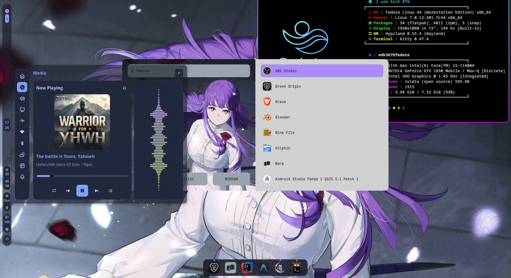
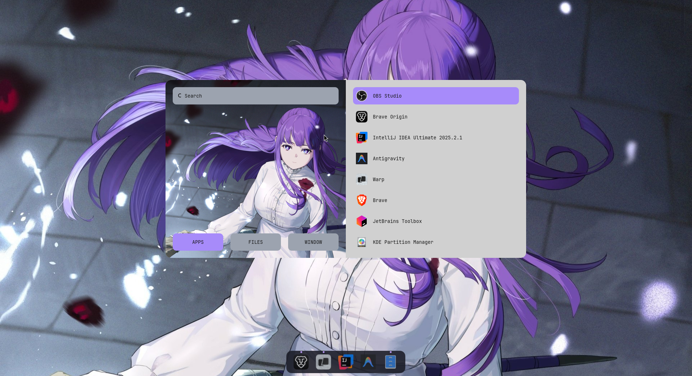
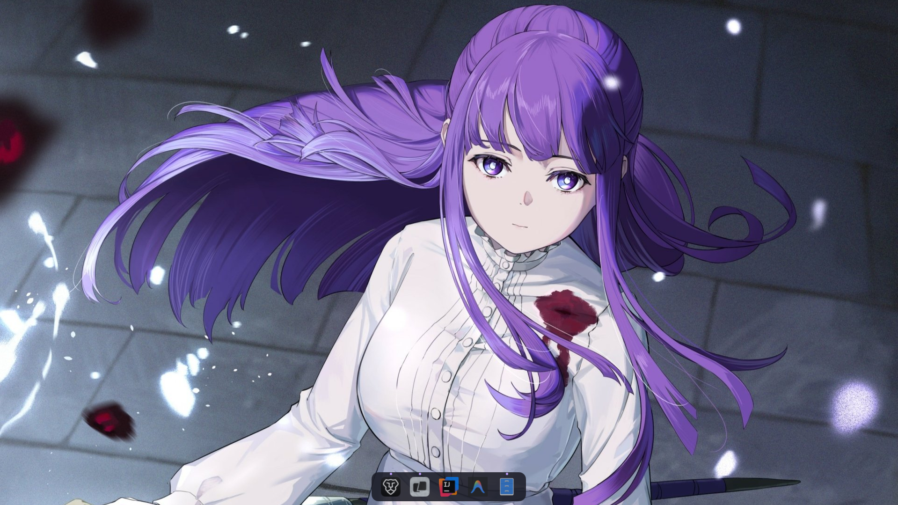
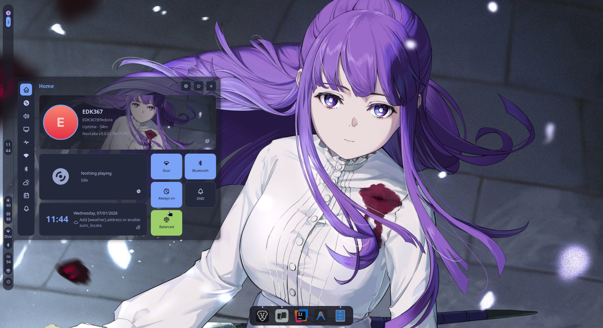
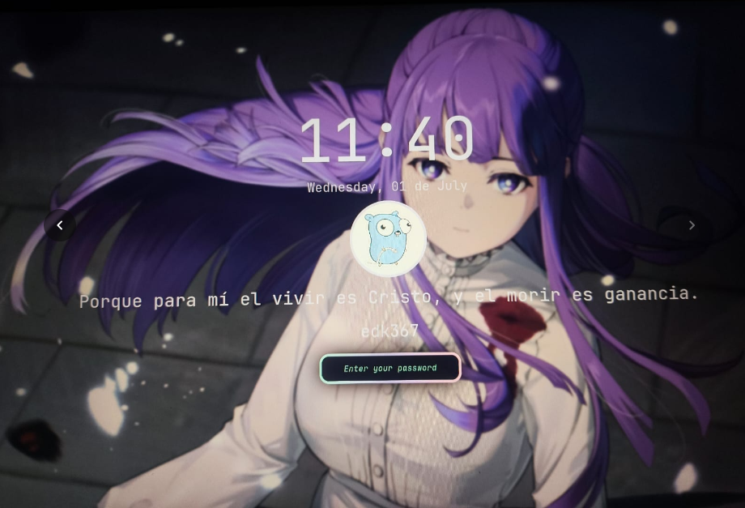

# Hyprland Dotfiles

Mi configuración personal de Hyprland actualmente Fedora.

> ⚠️ Actualmente la instalación es completamente manual.
> Más adelante agregaré un instalador automático.

---

# Vista previa



## Launcher (Rofi)



## Hyprland



## Noctalia



## Lock Screen



---

# Contenido

- Hyprland
- Hyprlock
- Hypridle
- Wallpapers
- Rofi personalizado
- Noctalia
- Atajos de teclado

---

# Dependencias

Instalar los paquetes necesarios.

Fedora

```bash
sudo dnf install \
hyprland \
hyprlock \
hypridle \
rofi-wayland \
waybar \
kitty \
noctalia \
grim \
slurp \
wl-clipboard \
swww
```

---

# Instalación

## 1. Crear la carpeta de configuración

Si no existe:

```bash
mkdir -p ~/.config/hypr
```

---

## 2. Copiar Hyprland

```bash
cp -r hyprland/* ~/.config/hypr/
```

---

## 3. Hyprlock

```bash
mkdir -p ~/.config/hypr
cp -r hyprlock/* ~/.config/hypr/
```

---

## 4. Hypridle

```bash
mkdir -p ~/.config/hypr
cp -r hypridle/* ~/.config/hypr/
```

---

## 5. Wallpapers

Copiar donde prefieras.

Ejemplo

```bash
mkdir -p ~/Pictures/Wallpapers
cp wallpapers/* ~/Pictures/Wallpapers/
```

Cambia la ruta del fondo y logo de user de lockscreen en:

```
hyprlock.conf
```

Y puedes configurar el fondo con noctalia
> ⚠️ Actualmentee se esta trabajando para no depender de Notcalia en un futuro
> Más adelante agregaré un la configuración del waybar.

---

# Rofi

El launcher fue tomando del increíble trabajo de:

https://github.com/adi1090x/rofi

En su repositorio encontraran las instruciones de la instalación.

Tomé uno de sus launchers y le hice pequeños cambios para mi gusto, los cuales fueron:

- colores
- tamaño
- botones
- categorías


# Noctalia
La configuración de Noctalia **no está incluida**, ya que fue realizada desde la interfaz gráfica.

Para replicarla:

1. Abrir Noctalia
2. Ir a Configuración.
3. Experimentar debido que Noctalia es muy intuitiva.

# Créditos

## Hyprland

https://github.com/hyprwm/Hyprland

## Rofi

https://github.com/adi1090x/rofi

Gracias a Aditya Shakya por el launcher.

---

# Pendiente

- [ ] Instalador automático
- [ ] Script de actualización
- [ ] Temas adicionales
- [ ] Waybar personalizada
- [ ] Eliminacion de Noctalia
- [ ] Extras
